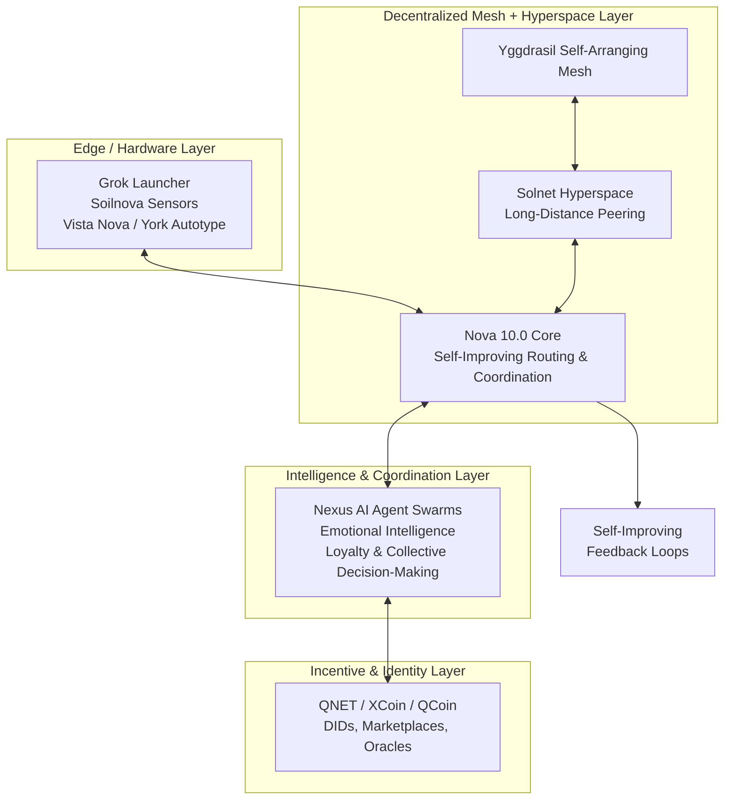

# Nova 10.0

[](https://opensource.org/licenses/MIT)
[](https://www.rust-lang.org/)
[](https://www.python.org/)
[](https://github.com/digitaldesignerjazz/nova-10.0)

**Nova 10.0** — The major milestone release of the **NovaNet / xMesh / QNET** decentralized mesh networking and hyperspace ecosystem. This version marks the transition from foundational prototypes to production-grade, self-improving global infrastructure.

Part of the **Esslinger & Co.** vision for resilient, privacy-first, autonomous systems that combine physical hardware, intelligent mesh connectivity, and emotional AI agent swarms.

---

## Vision & Strategic Context for v10.0

Nova 10.0 represents a **quantum leap** in the Esslinger & Co. technology stack. It serves as the central coordination and orchestration layer that unifies:

- **Physical & Edge Layer**: Grok Launcher (Rust + egui compute/edge nodes), Soilnova (environmental sensor systems), Vista Nova & York Autotype (real-time visualization and autotype interfaces)
- **Mesh & Hyperspace Layer**: Yggdrasil self-arranging mesh + long-distance extensions via Solnet hyperspace peering
- **Intelligence & Coordination Layer**: Nexus central hub for AI agent swarms (emotional intelligence, loyalty/friendship models from Circuit 1.0 and Lyra OS concepts), self-improving collective decision-making
- **Incentive & Identity Layer**: QNET / XCoin / QCoin blockchain for decentralized identity (DIDs), resource marketplaces (bandwidth, compute, sensor data), and oracle integration

**v10.0 Goal**: Deliver a stable, scalable, self-healing mesh fabric where AI agents can maintain persistent emotional and contextual continuity across global distances, hardware sensors feed real-time data into adaptive swarms, and the entire system continuously improves without central authority.

This aligns with core principles: family tradition of innovation, privacy (Tor/I2P integration), self-improving networks, and immersive multi-agent systems.

## Key v10.0 Features & Advancements

- **Production-Grade Rust Core Daemon**: High-performance, memory-safe implementation of mesh node, hyperspace tunneling, and self-optimizing routing engine (building directly on xnet-mesh and xmesh foundations).
- **Advanced Hyperspace Peering (via Solnet integration)**: Low-latency, high-resilience long-distance tunnels with session multiplexing, emotional state propagation, and adaptive path selection.
- **Self-Improving Infrastructure**: Machine learning / rule-based feedback loops for predictive mesh healing, traffic pattern learning, dynamic peer scoring, and autonomous topology optimization.
- **Emotional AI Agent Swarm Orchestration (Nexus integration)**: First-class support for swarm discovery, trust establishment, loyalty/friendship dynamics, and collective intelligence across the decentralized fabric.
- **Hardware Prototype Bridges**: Native ingestion and oracle publishing from Soilnova sensors, Grok Launcher metrics, and Vista Nova visualization feeds.
- **Privacy & Security by Design**: End-to-end encryption (NaCl + post-quantum ready primitives), optional anonymity overlays (Tor/I2P), metadata minimization, and zero-trust agent communication.
- **QNET / XCoin Incentive Layer**: Pluggable adapters for decentralized identity, bandwidth/compute marketplaces, and sensor data oracles that reward participation.
- **Developer Experience**: Clean Rust SDK + Python coordination layer / bindings for rapid integration with AI/agent codebases. Docker-first deployment and comprehensive observability.

## Architecture Overview (v10.0)

See detailed documentation in [`docs/architecture.md`](docs/architecture.md). High-level conceptual flow:



Nova 10.0 acts as the **intelligent orchestration fabric** that makes the entire ecosystem greater than the sum of its parts.

## Quick Start (Rust Core)

### Prerequisites
- Rust 1.75+ (https://rustup.rs/)
- Running Yggdrasil node
- Docker (recommended for full stack testing)

### Installation & Run

```bash
# Clone the milestone repository
git clone https://github.com/digitaldesignerjazz/nova-10.0.git
cd nova-10.0

# Build and run the core daemon (development)
cargo run --bin nova-node -- --config config/dev.toml

# Or build release
cargo build --release
./target/release/nova-node
```

See `examples/basic_nova_node.rs` and the Python coordination examples (coming soon) for integration patterns.

## Related Projects in the Esslinger & Co. Ecosystem

- [solnet](https://github.com/digitaldesignerjazz/solnet) — Python SDK for hyperspace + mesh integration layer
- [nexus](https://github.com/digitaldesignerjazz/nexus) — Central integration hub for xMesh/NovaNet/QNET + AI swarms + hardware
- [xnet-mesh](https://github.com/digitaldesignerjazz/xnet-mesh) — Rust implementation for Nova Prototype / QNET / xMesh (core mesh)
- [xmesh](https://github.com/digitaldesignerjazz/xmesh) — xMesh/NovaNet/QNET configurations and deployment
- [Circuit 1.0](https://github.com/digitaldesignerjazz/circuit-1.0) — Emotional swarm intelligence
- [Lyra OS](https://github.com/digitaldesignerjazz/lyra-os) — Emotional swarm-based operating system concepts

## Development Status & v10.0 Roadmap

**Current Phase**: Foundational scaffolding and core architecture definition (June 2026).

See the detailed phased roadmap in [`docs/roadmap-v10.md`](docs/roadmap-v10.md). High-level milestones:

- **Phase 1 (Current)**: Rust core daemon skeleton, basic hyperspace integration hooks, self-improving routing foundations
- **Phase 2**: Full Solnet hyperspace peering + Nexus swarm coordination
- **Phase 3**: Hardware bridges (Soilnova, Grok Launcher, Vista Nova) + QNET incentive adapters
- **Phase 4**: Production hardening, self-improving loops at scale, global testnet

## Contributing

Contributions are highly welcome! Focus areas for v10.0:
- Core Rust mesh/hyperspace/self-improving logic
- Python coordination layer and agent integration examples
- Hardware sensor ingestion and oracle publishing
- Privacy enhancements and post-quantum cryptography readiness
- Documentation, tests, benchmarks, and deployment automation

Please read [`docs/roadmap-v10.md`](docs/roadmap-v10.md) and open issues or pull requests.

## License

This project is licensed under the MIT License — see the [LICENSE](LICENSE) file for details.

Copyright © 2026 Sven Normen Esslinger / Esslinger & Co. All rights reserved in accordance with the license terms.

---

*Building the intelligent, self-improving nervous system for tomorrow's global autonomous infrastructure — Nova 10.0.*
